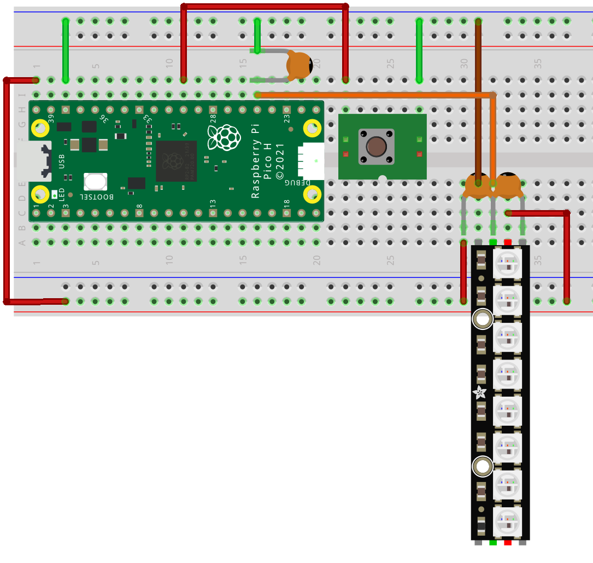

# WS2812B RGB LED string on the Pi Pico MCU in C

This is a demonstration of using a spi interface on the Pi Pico MCU to control 
a strip of WS2812B RGB LEDs. The source code is in C and uses the Pi Pico SDK 
with multicore support.


# Table of Contents

- [Prerequisites](#prerequisites)
- [NeoPixel Demo](#neopixel-demo)
  - [WS2812B NeoPixels](#ws2812b-neopixels)
  - [SPI Interface](#spi-interface)
- [Build](#build)
- [Reference Links](#reference-links)
- [Setup](#setup)
  - [Workstation Setup](#workstation-setup)
  - [Pi Pico SDK](#clone-pi-pico-sdk)


## Prerequisites

- Pi Pico MCU
- WS2812B LED strip
- 22pF ceramic capacitors
- Breadboard with jumper wires
- USB cable to connect the Pi Pico to the workstation
- Linux workstation (Fedora 37 was used to create the demo)


## NeoPixel Demo

The objective of this demo is to control a strip of WS2812B LEDs (aka NeoPixels)
with a spi interface on the Pi Pico MCU. The source code is written in the C
programming language and leverages the Pico SDK.


### WS2812B NeoPixels

The WS2812B LEDs do not have a spi interface but do use a single serial data 
line where a control signal programs the LED display. The signal used on the 
data line is both a clock signal and a bit data signal combined. The data bits 
are used to modulate the pulse width of the clock signal.

Based on the datasheet the period of the clock rate for the signal can range 
from 1.85us to 0.65us which translates to a clock frequencey from 540kHz to
1.54MHz. This will be taken into consideration when selecting the spi baud rate.

Each LED pixel is programmed to display a color based on 24 bits of data that 
comprises 3 bytes of color GRB (green, red, blue) data. When the clocked 
data stream begins the first LED will strip off the first 24 bit, or clock 
cycles, and pass the remaining bits on to the next LED.

Clock cycle diagram for low and high data bit:
```
               |    ____
   0 bit     v |   |    |      |
clock cycle  o |   |    |______|
             l |    ______
   1 bit     t |   |      |    |
clock cycle  s |   |      |____|
               |
               +---+---+---+---+---
                     time
```
The diagram above shows a clock cycle for a data bit value of 0 and a 
clock cycle for a data bit value of 1. Note how the time that the clock 
cycle is high for a 0 bit value is a shorter time duration than the 
clock cycle for the 1 bit value.

The variation in the time that the data line stays high during a clock 
cycle is how each data bit is determined.

The datasheet provides guidance on the allowed time duration for the 
clock cycle for a 0 data bit and 1 data bit.

| Clock Level | Data Bit | Minimum Time | Maximum Time |
| ----------- | -------- | ------------ | ------------ |
| High        | 0        | 0.25us       | 0.55us       |
|             | 1        | 0.65us       | 0.95us       |
| Low         | 0        | 0.70us       | 1.00us       |
|             | 1        | 0.30us       | 0.60us       |

**NOTE:** Through experimentation it appears that it is critical 
to keep the time period for the high clock level below the 
maximum time period to prevent LED glitching. While the time 
period while the clock cycle is low is more forgiving.


### SPI Interface

The spi interface can be used as a serial data source, however, the 
pulse width of the data signal is fixed by the selected baud rate.
To overcome this limitation and enable serial programming of the 
WS2812B LED pixels from the spi interface we will select a baud 
rate much faster than the data rate of the LED pixels and use multiple 
spi data bits to represent each individual LED pixel data bit.

With a spi interface baud rate of 8Mbps a full byte (8 spi bits) of 
data on the spi interface can be used to represent a single clock 
cycle of 1us. This translates into an LED pixel data clock rate of 1MHz.

At a 1us period with 8 bit divisions we can adjust the width of the 
clock pulse high in increments of 0.125us.

SPI Interface 8 bits to form 1 LED clock cycle for bit value 0:
```
  |   _____
  |  |  .  |  .  .  .  .  .  |
  |  |  .  |  .  .  .  .  .  |
  |  |  .  |_________________|
  |  
  +--+--+--+--+--+--+--+--+--+--

      0.25us      0.75us
```


SPI Interface 8 bits to form 1 LED clock cycle for bit value 1:
```
  |   _________________
  |  |  .  .  .  .  .  |  .  |
  |  |  .  .  .  .  .  |  .  |
  |  |  .  .  .  .  .  |_____|
  |  
  +--+--+--+--+--+--+--+--+--+--

           0.75us      0.25us
```

**NOTE:** The clock low time of 0.25us is below specification but the WS2812B 
seems to accept the lower durations on the low level of the clock cycle.


## Circuit

The circuit starts with the Pi Pico with a reset button and adds the 8 LED 
NeoPixel stick and some 22pf capacitors to smooth out ringing on the data 
signal.

In the neopixel.h header file you will find the SPI0 pin assignments where 
GPIO 16 through 19 are assigned to the SPI0 interface. However, we only wire
up the SPI0_MISO (TX) transmit line to the data in pin on the NeoPixel LED 
strip.

A 22pf capacitor is connected from the SPI0_MISO line to ground, and at the 
data in pin on the NeoPixel LED strip a 22pf capacitor is connected between 
data in and ground and another 22pf capacitor is connected between the data 
in and the +5VCC pin.
```c
// spi0 GPIO pin assignments
#define SPI0_CS 17
#define SPI0_SCK 18
#define SPI0_MOSI 19
#define SPI0_MISO 16
```

To power the NeoPixel LED strip we run a +5V connection from the PI Pico 
VBUS pin to the +5VCC pin on the LED strip.

**NOTE:** Be careful with the +5V connection, the Pi Pico GPIO inputs operate at 3.3V and a 5V signal may cause damage.


## Build

Assuming you already have a development environment setup as was used in the
previous pi-pico-linux-c projects then you can clone this repo, create a build 
directory, run cmake, then make, and lastly copy the resulting neopixel.uf2 
file to the Pi Pico.

> git clone https://github.com/bnielsen1965/pi-pico-c-neopixel.git

> cd pi-pico-c-neopixel

> mkdir build

> cd build

*skip the export step if you already exported the pico-sdk path in your environment*
> export PICO_SDK_PATH=~/Embedded/pico-sdk/

> cmake ..

> make

*connect Pi Pico with USB cable and start with bootsel held down*
> cp neopixel.uf2 /run/media/$(whoami)/RPI-RP2/


## Reference Links

- Fedora Linux: [https://getfedora.org/](https://getfedora.org/)
- Raspberry Pi Pico: [https://www.raspberrypi.com/products/raspberry-pi-pico/](https://www.raspberrypi.com/products/raspberry-pi-pico/)
- Pi Pico SDK: [https://github.com/raspberrypi/pico-sdk](https://github.com/raspberrypi/pico-sdk)
- adafruit 8 x 5050 RGB LED stick [https://www.adafruit.com/product/1426](https://www.adafruit.com/product/1426)
- WS2812B Datasheet [https://cdn-shop.adafruit.com/datasheets/WS2812B.pdf](https://cdn-shop.adafruit.com/datasheets/WS2812B.pdf)


## Setup

The development environment used to create the demo is the same environment 
used in previous pi-pico-linux-c projects. Some brief instructions are 
included here to assist in setting up a new environment.


### Workstation Setup

The Linux workstation will require some software packages installed
before developing an application for the Pi Pico. You can use your
favored editor and terminal application, but you will also need *git*, *cmake*, and *g++*.

(Fedora 37 install command)

> sudo dnf install git cmake g++

The ARM cross compilers and libraries are also needed to compile 
and link binaries for the ARM processor on the Pi Pico.

(Fedora 37 install commands)

> sudo dnf install arm-none-eabi-gcc-cs

> sudo dnf install arm-none-eabi-gcc-cs-c++

> sudo dnf install arm-none-eabi-newlib


### Clone Pi Pico SDK

Create a project folder in your home directory where the work will be performed.
In this example we will be using the working directory named *Embedded*.

> cd ~

> mkdir Embedded

> cd Embedded

The Pi Pico SDK can be cloned from the raspberrypi github
repository.

(Clone pico-sdk project and update submodules)

> git clone https://github.com/raspberrypi/pico-sdk

> cd pico-sdk

> git submodule update --init

Return to the project directory and export the path 
environment variable for the pico-sdk.

> cd ..

> export PICO_SDK_PATH=~/Embedded/pico-sdk/
